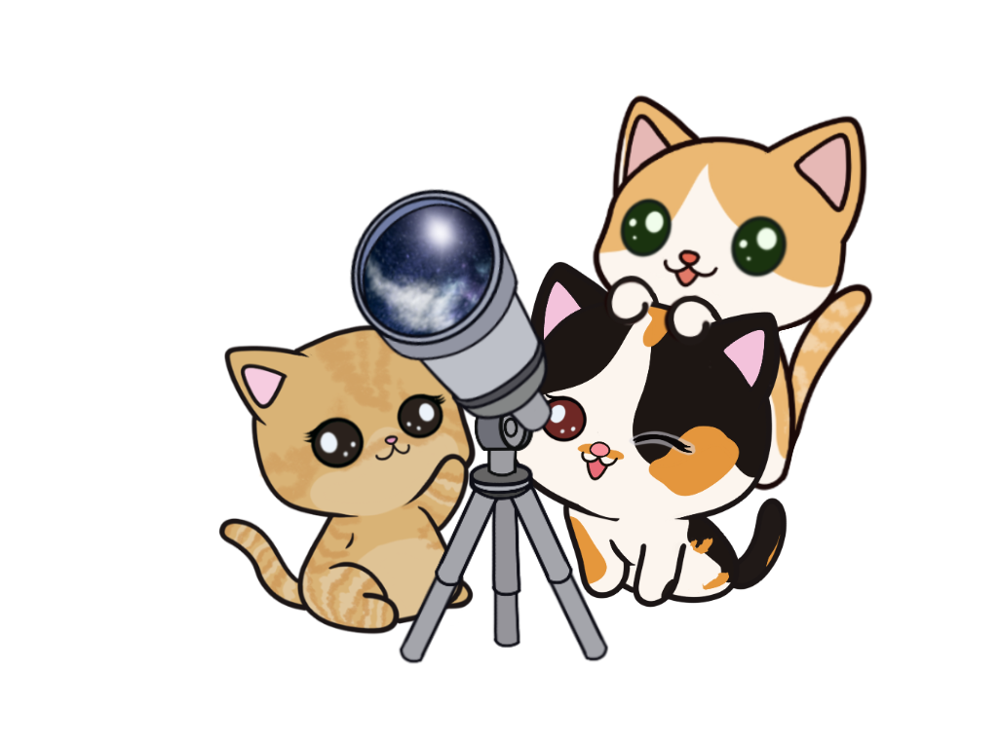

# Astro

Astro prints astronomical information.

Usage:

    astro [-jpokm] [-c nperiod] [-C tperiod] [-d date] [-e obj1 obj2] [-l nlat wlong elev] [-t ΔT]

Astro reports upcoming celestial events, by default for 24 hours starting now.

The `-j` flag causes astro to print the Julian date.

The `-p` flag causes astro to print the positions of objects at the given time
rather than searching for interesting conjunctions. For each, the name is
followed by the right ascension (hours, minutes, seconds), declination
(degrees, minutes, seconds), azimuth (degrees), elevation (degrees), and
semidiameter (arc seconds). For the sun and moon, the magnitude is also
printed. The first line of output presents the date and time, sidereal time,
and the latitude, longitude, and elevation.

The `-o` flag causes astro to search for stellar occultations.

The `-k` flag causes astro to print times in local time (“kitchen clock”).

The `-m` flag causes astro to include a single comet in the list of objects.
This is modified (in the source) to refer to an approaching comet but in
steady state usually refers to the last interesting comet (currently
153P/Ikeya–Zhang).

The `-c` flag causes astro to report for n (default 1) successive days.

The `-C` flag is used with -c and sets the interval to d days (or fractions of
days).

The `-d` flag causes astro to read the starting date.

The `-e` flag causes astro to report distance between the centers of objects,
in arc seconds, during eclipses or occultations involving obj1 and obj2.

The `-l` flag causes astro to read the north latitude, west longitude, and
elevation of the observation point. If l is missing, the initial position is
read from the file $PLAN9/sky/here, or /usr/local/plan9/sky/here if $PLAN9
is not set.

The `-t` flag causes astro to read ΔT. ΔT is the difference between
ephemeris and universal time (seconds) due to the slowing of the earth’s
rotation. ΔT is normally calculated from an empirical formula. This option is
needed only for very accurate timing of occultations, eclipses, etc.

Dasol Dargan designed the [cat image](doc/images/cats-telescope.png), licensed
under Creative Commons Attribution 4.0, meaning you can use the image, but you
must credit the creator.
